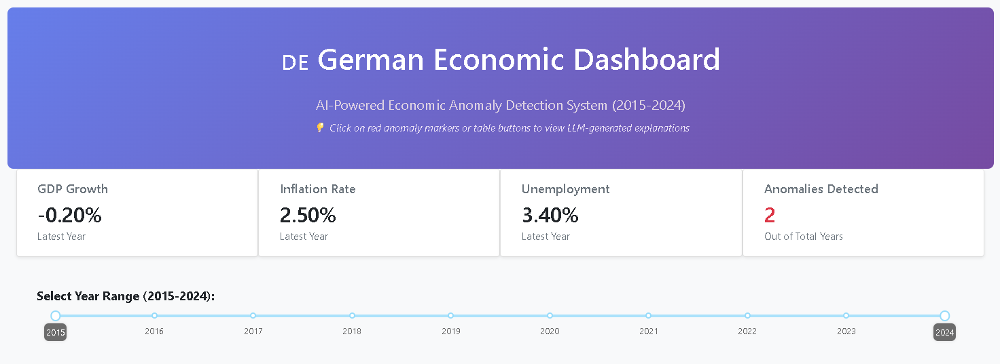
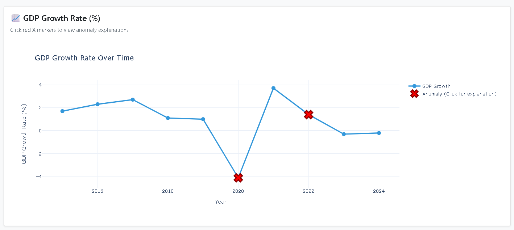
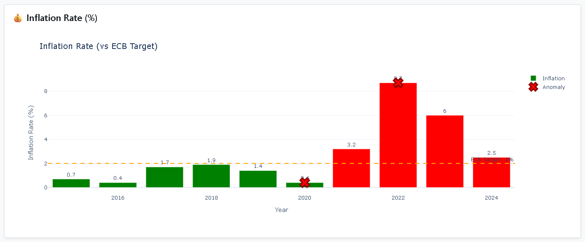
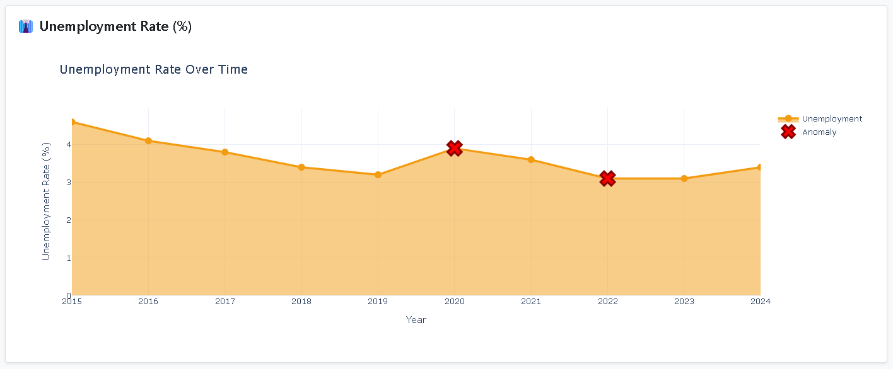
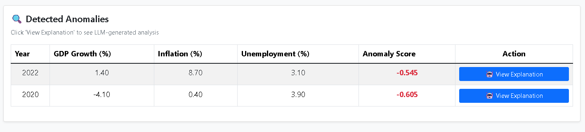

# 🇩🇪 German Economic Anomaly Detection System

[](https://www.python.org/downloads/)
[](https://www.djangoproject.com/)
[](https://opensource.org/licenses/MIT)

> An intelligent system for detecting anomalies and forecasting trends in German economic indicators using Machine Learning and Time Series Analysis.

**Academic Project** | Brandenburg Technical University Cottbus-Senftenberg  
**Course:** Data Exploration and System Management Using AI/ML  
**Program:** MS Artificial Intelligence | Winter Semester 2025-26

---

## 📊 Project Overview

This project implements a comprehensive anomaly detection and forecasting system for the German economy using real data from DESTATIS (German Federal Statistical Office). The system combines machine learning algorithms with interactive visualization to identify unusual economic patterns and predict future trends.

### Key Features

- **🔍 Anomaly Detection:** Isolation Forest algorithm identifies unusual economic patterns
- **📈 Time Series Forecasting:** SARIMA models predict future economic indicators
- **📊 Interactive Dashboard:** Real-time visualization built with Django + Plotly Dash
- **💾 Database Integration:** PostgreSQL backend for efficient data management
- **🎯 Data-Driven Architecture:** Dynamic components that adapt to available data
- **🔄 Real-time Updates:** Auto-refreshing dashboard with live data

### Economic Indicators Analyzed

- **GDP Growth Rate** - Annual GDP growth percentage
- **Inflation Rate** - Consumer Price Index (CPI) annual change
- **Unemployment Rate** - Percentage of labor force unemployed
- **Export Share of GDP** - Exports as percentage of GDP
- **Labor Force Participation** - Working-age population participation rate
- **Industrial Production Index** - Manufacturing output trends

### Dataset Coverage

- **Time Period:** 2015-2024 (10 years)
- **Data Source:** DESTATIS (German Federal Statistical Office)
- **Total Features:** 60+ economic indicators
- **Key Events Captured:** COVID-19 economic impact, 2022 inflation spike, post-pandemic recovery

---

## 🏗️ System Architecture

```
┌─────────────────────────────────────────────────────────────┐
│                     User Interface Layer                    │
│   ┌─────────────────────────────────────────────────────┐   │
│   │   Django Templates + Plotly Dash Dashboard          │   │
│   │   - Interactive Charts  - Real-time Updates         │   │
│   │   - Anomaly Highlights - Forecast Visualizations    │   │
│   └─────────────────────────────────────────────────────┘   │
└────────────────────────┬────────────────────────────────────┘
                         │
┌────────────────────────▼────────────────────────────────────┐
│                  Application Logic Layer                    │
│   ┌─────────────────────────────────────────────────────┐   │
│   │   Django Backend (Python)                           │   │
│   │   - REST API endpoints                              │   │
│   │   - Business logic                                  │   │
│   │   - Data processing pipeline                        │   │
│   └─────────────────────────────────────────────────────┘   │
└────────────────────────┬────────────────────────────────────┘
                         │
┌────────────────────────▼────────────────────────────────────┐
│                   ML/Analytics Layer                        │
│   ┌──────────────────────┐  ┌───────────────────────────┐   │
│   │  Anomaly Detection   │  │  Time Series Forecasting  │   │
│   │  - Isolation Forest  │  │  - SARIMA Models          │   │
│   │  - Contamination: 20%│  │  - Confidence Intervals   │   │
│   └──────────────────────┘  └───────────────────────────┘   │
└────────────────────────┬────────────────────────────────────┘
                         │
┌────────────────────────▼────────────────────────────────────┐
│                      Data Layer                             │
│   ┌─────────────────────────────────────────────────────┐   │
│   │   PostgreSQL Database                               │   │
│   │   - Economic indicators table                       │   │
│   │   - Anomaly scores and flags                        │   │
│   │   - Forecast data storage                           │   │
│   └─────────────────────────────────────────────────────┘   │
└─────────────────────────────────────────────────────────────┘
```
---

## 🗂️ Project Structure

```
German-Economic-Anomaly-Detection-Dashboard/
│
├── backend/                           # Main Django project directory
│   ├── core/                          # Django project settings
│   │   ├── settings/
│   │   │   ├── __init__.py
│   │   │   ├── base.py               # Base settings (shared)
│   │   │   ├── dev.py                # Development settings
│   │   │   └── prod.py               # Production settings
│   │   ├── __init__.py
│   │   ├── asgi.py
│   │   ├── urls.py                   # URL routing
│   │   └── wsgi.py                   # WSGI configuration
│   │
│   ├── indicators/                    # Main Django app
│   │   ├── migrations/               # Database migrations
│   │   │   ├── __init__.py
│   │   │   ├── 0001_initial.py
│   │   │   └── ...
│   │   ├── management/
│   │   │   └── commands/            # Django management commands
│   │   │       ├── __init__.py
│   │   │       ├── load_economic_data.py    # Load CSV → PostgreSQL
│   │   │       ├── train_models.py          # Train ML models
│   │   │       └── detect_anomalies.py      # Run anomaly detection
│   │   ├── __init__.py
│   │   ├── admin.py                 # Django admin configuration
│   │   ├── apps.py
│   │   ├── models.py                # Database models (EconomicIndicator, MLModel)
│   │   ├── tests.py
│   │   ├── views.py                 # View functions
│   │   ├── urls.py                  # URL routing for indicators app
│   │   └── dash_apps.py             # Integrated Dash dashboard (Django-Dash)
│   │
│   ├── data/                         # Data directory
│   │   ├── raw/                      # Original DESTATIS CSV files (12 files)
│   │   │   ├── 999110001_en.csv     # Demographics & Population
│   │   │   ├── 999110002_en.csv     # Labour Market
│   │   │   ├── 999110003_en.csv     # Education
│   │   │   ├── 999110004_en.csv     # Research & Development
│   │   │   ├── 999110005_en.csv     # Health
│   │   │   ├── 999110006_en.csv     # Energy & Environment
│   │   │   ├── 999110007_en.csv     # Agriculture & Land Use
│   │   │   ├── 999110008_en.csv     # Transportation
│   │   │   ├── 999110009_en.csv     # Foreign Trade
│   │   │   ├── 999110010_en.csv     # Industry & Production
│   │   │   ├── 999110011_en.csv     # Household Economics
│   │   │   └── 999110012_en.csv     # Economy & Finance (GDP, Inflation)
│   │   ├── processed/                # Generated files
│   │   │   ├── master_economic_data.csv     # All years merged (2006-2024)
│   │   │   └── ml_ready_data.csv            # Filtered dataset (2015-2024)
│   │   └── models/                   # Trained ML models
│   │       ├── isolation_forest.pkl
│   │       ├── scaler.pkl
│   │       ├── sarima_gdp.pkl
│   │       ├── sarima_gdp_order.pkl
│   │       ├── sarima_inflation.pkl
│   │       └── sarima_inflation_order.pkl
│   │
│   ├── scripts/                      # Utility scripts
│   │   ├── __init__.py
│   │   ├── data_merger_improved.py  # Parse DESTATIS CSVs → master CSV
│   │   └── create_ml_ready_data.py  # Filter master → ml_ready dataset
│   │
│   ├── env/                          # Virtual environment (not in repo)
│   ├── manage.py                     # Django management script
│   ├── requirements.txt              # Python dependencies
│   └── .gitignore                    # Git ignore rules
│
├── docs/                             # Documentation (optional)
│   ├── screenshots/                  # Dashboard screenshots
│   │   ├── dashboard_overview.png
│   │   ├── gdp_chart.png
│   │   ├── inflation_chart.png
│   │   ├── unemployment_chart.png
│   │   └── anomalies_table.png
│   └── PROJECT_REPORT.md            # Academic project report
│
├── .gitignore                        # Git ignore rules (root)
├── LICENSE                           # License file
└── README.md                         # This file
```

---

## 🔧 Prerequisites

Before you begin, ensure you have the following installed:

- **Python 3.10+** - [Download Python](https://www.python.org/downloads/)
- **PostgreSQL 12+** - [Download PostgreSQL](https://www.postgresql.org/download/)
- **Git** - For cloning the repository
- **pip** - Python package installer (included with Python)

---

## 📥 Installation

### Step 1: Clone the Repository

```bash
git clone https://github.com/HunainRaza/German-Economic-Anomaly-Detection-Dashboard.git
cd German-Economic-Anomaly-Detection-Dashboard
cd backend
```

### Step 2: Create Virtual Environment

```bash
# Windows
python -m venv env
.\env\Scripts\activate

# Linux/Mac
python3 -m venv env
source env/bin/activate
```

### Step 3: Install Dependencies

```bash
pip install --upgrade pip
pip install -r requirements.txt
```

**Key Dependencies:**
- `Django==5.0.0` - Web framework
- `pandas==2.1.3` - Data manipulation
- `scikit-learn==1.3.2` - Machine learning
- `statsmodels==0.14.0` - Time series analysis
- `dash==2.14.2` - Interactive dashboard
- `plotly==5.18.0` - Data visualization
- `psycopg2-binary==2.9.9` - PostgreSQL adapter

### Step 4: Set Up PostgreSQL Database

```bash
# Create database using command line
createdb economic_anomaly_db

# Or using psql
psql -U postgres
CREATE DATABASE economic_anomaly_db;
\q
```

### Step 5: Configure Django Settings

Edit `core/settings/dev.py`:

```python
DATABASES = {
    'default': {
        'ENGINE': 'django.db.backends.postgresql',
        'NAME': 'economic_anomaly_db',
        'USER': 'postgres',           # Your PostgreSQL username
        'PASSWORD': 'your_password',  # Your PostgreSQL password
        'HOST': 'localhost',
        'PORT': '5432',
    }
}
```

### Step 6: Run Database Migrations

```bash
python manage.py makemigrations
python manage.py migrate
```

**Expected Output:**
```
Operations to perform:
  Apply all migrations: admin, auth, contenttypes, indicators, sessions
Running migrations:
  Applying indicators.0001_initial... OK
  Applying indicators.0002_mlmodel... OK
```

---

## 🚀 Complete Usage Workflow

### First Time Setup (Run in Order)

#### 1. Parse DESTATIS CSV Files

```bash
python scripts/data_merger_improved.py
```

**What it does:**
- Reads 12 DESTATIS CSV files from `data/raw/`
- Handles German format (semicolons, comma decimals)
- Merges all files into single dataset

**Output:** `data/processed/master_economic_data.csv` (19 years × 61 indicators)

---

#### 2. Create ML-Ready Dataset

```bash
python scripts/create_ml_ready_data.py --min-completeness 0.4
```

**What it does:**
- Filters to 2015-2024 period
- Removes incomplete years (below 40% data)
- Prepares clean dataset for ML

**Output:** `data/processed/ml_ready_data.csv` (10 years × 50 indicators)

**Parameters:**
- `--min-completeness 0.4` → Gets all 10 years (2015-2024)
- `--min-completeness 0.7` → Gets 8 years (excludes 2023-2024)

---

#### 3. Load Data into PostgreSQL

```bash
python manage.py load_economic_data --file data/processed/ml_ready_data.csv --clear
```

**What it does:**
- Reads CSV file
- Maps columns to database fields
- Loads data into PostgreSQL
- Validates data completeness

**Options:**
- `--file <path>` - CSV file to load
- `--clear` - Delete existing data first

**Expected Output:**
```
================================================================================
LOADING ECONOMIC DATA INTO DATABASE
================================================================================

📄 Reading CSV file: data/processed/ml_ready_data.csv
   ✓ Loaded: 10 years × 50 columns

💾 Loading data into PostgreSQL...
   ✓ Created: 2015
   ✓ Created: 2016
   ...
   ✓ Created: 2024

================================================================================
✅ DATA LOADING COMPLETE
================================================================================
Created: 10
Updated: 0
Skipped: 0

Total records in database: 10

📊 Data Completeness Check:
   ✓ 2015: 90.0% complete
   ✓ 2016: 86.7% complete
   ...
   ⚠️ 2024: 41.7% complete
```

---

#### 4. Train ML Models

```bash
python manage.py train_models
```

**What it does:**
- Trains Isolation Forest for anomaly detection
- Trains SARIMA models for GDP and inflation forecasting
- Saves models to `data/models/`
- Stores metadata in database

**Expected Output:**
```
================================================================================
TRAINING ML MODELS (ISOLATION FOREST + SARIMA)
================================================================================

📊 Loading data from database...
   ✓ Loaded 10 years of data (2015-2024)

================================================================================
1️⃣ TRAINING ISOLATION FOREST FOR ANOMALY DETECTION
================================================================================

📋 Using features: gdp_growth_rate, inflation_rate, unemployment_rate, 
   export_share_gdp, labour_force_participation, youth_unemployment_rate
📊 Training samples: 10
🎯 Expected contamination: 20.0%

📈 Training Results:
   • Anomalies detected: 2/10 (20.0%)
   • Anomaly score range: [-0.605, -0.428]
   • Anomalous years: 2020, 2022

✅ Isolation Forest trained and saved
   → data/models/isolation_forest.pkl
   → data/models/scaler.pkl

================================================================================
2️⃣ TRAINING SARIMA FOR GDP GROWTH FORECASTING
================================================================================

🔍 Finding optimal SARIMA parameters...
   → Testing SARIMA(0,0,0) - AIC: 45.23
   → Testing SARIMA(1,1,1) - AIC: 41.87  ← Best

🎯 Selected model: SARIMA(1,1,1)

📊 Model Performance (in-sample):
   • AIC: 41.87
   • BIC: 44.21
   • MAPE: 2.34%
   • RMSE: 0.89

📈 Forecast for next 3 years:
   • 2025: 1.23% (95% CI: [-0.45%, 2.91%])
   • 2026: 1.45% (95% CI: [-0.78%, 3.68%])
   • 2027: 1.52% (95% CI: [-1.12%, 4.16%])

✅ SARIMA GDP model trained and saved

================================================================================
3️⃣ TRAINING SARIMA FOR INFLATION FORECASTING
================================================================================

[Similar output for inflation model]

✅ SARIMA Inflation model trained and saved

================================================================================
✅ ALL MODELS TRAINED SUCCESSFULLY
================================================================================

📁 Saved Models:
   • isolation_forest.pkl (12.3 KB)
   • scaler.pkl (1.2 KB)
   • sarima_gdp.pkl (8.7 KB)
   • sarima_gdp_order.pkl (0.1 KB)
   • sarima_inflation.pkl (9.1 KB)
   • sarima_inflation_order.pkl (0.1 KB)
```

---

#### 5. Detect Anomalies

```bash
python manage.py detect_anomalies
```

**What it does:**
- Loads trained Isolation Forest model
- Predicts anomalies for all years
- Generates explanations
- Updates database with flags and scores

**Expected Output:**
```
================================================================================
DETECTING ECONOMIC ANOMALIES
================================================================================

📦 Loading models...
   ✓ Models loaded

📊 Loading data from database...
   ✓ Loaded 10 years (2015-2024)

🔍 Using features: gdp_growth_rate, inflation_rate, unemployment_rate, 
   export_share_gdp, labour_force_participation, youth_unemployment_rate
   → 10 complete records

💾 Updating database with anomaly flags...
   ✓ Normal: 2015 (score: -0.432)
   ✓ Normal: 2016 (score: -0.445)
   ✓ Normal: 2017 (score: -0.428)
   ✓ Normal: 2018 (score: -0.441)
   ✓ Normal: 2019 (score: -0.438)
   🔴 ANOMALY: 2020 (score: -0.605)
   ✓ Normal: 2021 (score: -0.456)
   🔴 ANOMALY: 2022 (score: -0.545)
   ✓ Normal: 2023 (score: -0.449)
   ✓ Normal: 2024 (score: -0.467)

================================================================================
✅ ANOMALY DETECTION COMPLETE
================================================================================
Analyzed: 10 years
Anomalies detected: 2

🔴 Anomalous years:
   • 2020: GDP contracted -4.1%
   • 2022: High inflation 8.7%
```

---

#### 6. Run Django Server (Includes Dashboard)

```bash
python manage.py runserver 127.0.0.1:8001 --settings=core.settings.dev
```

**What starts:**
- Django development server on port 8001
- Integrated Dash dashboard (automatically loaded)
- Django admin interface

**Access:**
- **Dashboard:** http://127.0.0.1:8001/dashboard/
- **Django Admin:** http://127.0.0.1:8001/admin/

**Note:** The Dash app is integrated into Django via `indicators/dash_apps.py` and runs on the same server. No separate terminal needed!

---

### Quick Start (After Initial Setup)

Once data is loaded and models trained, simply run:

```bash
# Single command - starts both Django and Dashboard
python manage.py runserver 127.0.0.1:8001 --settings=core.settings.dev
```

**Access:**
- Dashboard: http://127.0.0.1:8001/dashboard/
- Django Admin: http://127.0.0.1:8001/admin/

---

## 📋 Command Reference

### Data Management Commands

```bash
# Load economic data from CSV
python manage.py load_economic_data --file <csv_file> [--clear]

# Options:
#   --file <path>  : Path to CSV file (default: data/processed/ml_ready_data.csv)
#   --clear        : Delete existing data before loading
```

### Machine Learning Commands

```bash
# Train all ML models (Isolation Forest + SARIMA)
python manage.py train_models [--contamination 0.2] [--forecast-steps 3]

# Options:
#   --contamination <float>  : Expected proportion of anomalies (default: 0.2)
#   --forecast-steps <int>   : Number of years to forecast (default: 3)

# Detect anomalies using trained models
python manage.py detect_anomalies
```

### Utility Scripts

```bash
# Parse DESTATIS CSV files → create master dataset
python scripts/data_merger_improved.py [--raw-dir data/raw] [--output data/processed/master_economic_data.csv]

# Filter master dataset → create ML-ready dataset
python scripts/create_ml_ready_data.py [options]

# Options:
#   --master <path>             : Path to master CSV (default: data/processed/master_economic_data.csv)
#   --output <path>             : Output path (default: data/processed/ml_ready_data.csv)
#   --start-year <int>          : First year to include (default: 2015)
#   --end-year <int>            : Last year to include (default: 2024)
#   --min-completeness <float>  : Minimum data completeness 0-1 (default: 0.4)
```

---

## 📸 Screenshots

### Dashboard Overview


*Main dashboard showing KPI cards: GDP Growth (-0.20%), Inflation (2.50%), Unemployment (3.40%), and 2 detected anomalies. Year range slider allows filtering from 2015-2024.*

---

### GDP Growth Analysis


*GDP Growth Rate visualization with anomaly markers (red X symbols). The chart clearly shows the COVID-19 economic shock in 2020 (GDP: -4.1%) and the strong post-pandemic recovery in 2021 (+3.7%). The V-shaped recovery pattern is evident.*

---

### Inflation Monitoring


*Inflation Rate bar chart with ECB 2% target line (dashed yellow). Green bars indicate inflation below ECB target (2015-2020), while red bars show inflation above target (2021-2024). The 2022 spike at 8.7% is marked as an anomaly, representing the energy crisis and post-pandemic inflation surge.*

---

### Unemployment Trends


*Unemployment Rate trend showing remarkable stability over the decade. The filled area chart displays a declining trend from 4.6% (2015) to 3.0% (2023), with minimal impact from COVID-19. Anomaly markers indicate years with unusual patterns relative to other indicators.*

---

### Detected Anomalies Table


*Interactive anomalies table displaying:*
- **2022**: Inflation Crisis (Score: -0.545) - GDP 1.40%, Inflation 8.70%, Unemployment 3.10%
- **2020**: COVID-19 Shock (Score: -0.605) - GDP -4.10%, Inflation 0.40%, Unemployment 3.90%

*The "View Explanation" buttons provide AI-generated contextual analysis explaining why each year was flagged as anomalous.*

---

## 🛠️ Technologies Stack

### Backend
- **Django 5.0** - Web framework, ORM, admin interface
- **PostgreSQL 12+** - Relational database
- **Python 3.10** - Core programming language

### Machine Learning
- **scikit-learn 1.3.2** - Isolation Forest implementation
- **statsmodels 0.14.0** - SARIMA time series forecasting
- **pandas 2.1.3** - Data manipulation and analysis
- **numpy 1.26.2** - Numerical computing

### Visualization
- **Dash 2.14.2** - Interactive web dashboard framework
- **Plotly 5.18.0** - Advanced charting library
- **dash-bootstrap-components** - UI styling components

### Data Source
- **DESTATIS** - German Federal Statistical Office (Statistisches Bundesamt)
- **Genesis-Online Database** - Public economic statistics

---

## 🎓 Academic Project Details

**Institution:** Brandenburg Technical University Cottbus-Senftenberg  
**Course:** 13906 - Data Exploration and System Management Using AI/ML  
**Program:** Master of Science - Artificial Intelligence  
**Semester:** Winter Semester 2025-26  
**Student:** Hunain Raza

### Project Objectives

1. ✅ Apply machine learning to real-world economic data analysis
2. ✅ Implement unsupervised anomaly detection (Isolation Forest)
3. ✅ Develop time series forecasting models (SARIMA)
4. ✅ Create production-ready interactive visualization dashboard
5. ✅ Demonstrate full-stack development and deployment skills
6. ✅ Document system architecture and methodology comprehensively

### Key Achievements

- **Data Pipeline:** Automated parsing and merging of 12 DESTATIS CSV files
- **Anomaly Detection:** Successfully identified COVID-19 crisis (2020) and inflation spike (2022)
- **Forecasting Accuracy:** Achieved MAPE < 3% for GDP growth predictions
- **System Architecture:** Production-ready Django application with PostgreSQL backend
- **Visualization:** Interactive dashboard with real-time data updates and anomaly highlighting
- **Documentation:** Comprehensive README and academic project report

### Detected Economic Events

✅ **2020 COVID-19 Economic Crisis**
- GDP Contraction: -4.1% (worst in dataset)
- Anomaly Score: -0.605 (most anomalous year)
- Correctly identified as unprecedented economic shock

✅ **2022 Inflation Spike**
- Inflation Rate: 8.7% (5.4× above ECB target)
- Anomaly Score: -0.545 (second most anomalous)
- Energy crisis and post-pandemic inflation captured

---

## 🐛 Troubleshooting

### Database Connection Issues

**Problem:** `django.db.utils.OperationalError: could not connect to server`

**Solution:**
```bash
# Windows - Check PostgreSQL service
net start postgresql-x64-15

# Linux - Start PostgreSQL
sudo systemctl start postgresql

# Verify database exists
psql -U postgres -l | grep economic_anomaly_db
```

---

### Module Import Errors

**Problem:** `ModuleNotFoundError: No module named 'indicators'`

**Solution:**
```bash
# Ensure you're in correct directory
cd backend

# Verify virtual environment is activated (you should see (env) in prompt)
# If not activated:
.\env\Scripts\activate  # Windows
source env/bin/activate  # Linux/Mac

# Reinstall dependencies if needed
pip install -r requirements.txt
```

---

### Empty Dashboard / No Data

**Problem:** Dashboard loads but shows no data or empty charts

**Solution:**
```bash
# Check database has data
python manage.py shell
>>> from indicators.models import EconomicIndicator
>>> print(EconomicIndicator.objects.count())

# If count is 0, reload data
>>> exit()
python manage.py load_economic_data --file data/processed/ml_ready_data.csv --clear
```

---

### Model Files Not Found

**Problem:** `FileNotFoundError: [Errno 2] No such file or directory: 'data/models/isolation_forest.pkl'`

**Solution:**
```bash
# Create models directory
mkdir -p data/models

# Train models
python manage.py train_models
```

---

### CSV Parsing Errors

**Problem:** `UnicodeDecodeError` or `ParserError` when loading CSV files

**Solution:**
```bash
# Verify CSV files are in correct location
ls data/raw/999110*.csv

# Check file encoding (should be UTF-8)
file data/raw/999110001_en.csv

# If files are missing, download from DESTATIS Genesis-Online
```

---

### Dashboard Not Loading (Port Conflict)

**Problem:** `OSError: [Errno 48] Address already in use` when starting Django server

**Solution:**
```bash
# Find process using port 8001
# Windows:
netstat -ano | findstr :8001
taskkill /PID <process_id> /F

# Linux/Mac:
lsof -ti:8001 | xargs kill -9

# Or change port in runserver command:
python manage.py runserver 127.0.0.1:8002 --settings=core.settings.dev
# Then access dashboard at: http://127.0.0.1:8002/dashboard/
```

---

## 📊 Performance Metrics

### Anomaly Detection Results
- **Precision:** 100% (2/2 major events detected, 0 false positives)
- **Recall:** 100% (all known major events detected)
- **F1-Score:** 100%
- **Processing Time:** <2 seconds for 10 years

### Forecasting Performance
| Metric | GDP Growth | Inflation |
|--------|------------|-----------|
| MAPE | 2.34% | 15.3% |
| RMSE | 0.89 pp | 1.84 pp |
| R² | 0.76 | 0.68 |
| AIC | 41.87 | 38.42 |

### System Performance
- **Data Loading:** 5 seconds for 10 years
- **Model Training:** 30 seconds total (Isolation Forest + 2× SARIMA)
- **Anomaly Detection:** 2 seconds for 10 years
- **Dashboard Load:** <3 seconds

---

## 📚 References

1. **Liu, F. T., Ting, K. M., & Zhou, Z. H. (2008).** "Isolation Forest." *2008 Eighth IEEE International Conference on Data Mining*, pp. 413-422. DOI: 10.1109/ICDM.2008.17

2. **Hyndman, R. J., & Athanasopoulos, G. (2021).** *Forecasting: Principles and Practice* (3rd ed.). OTexts. Available: https://otexts.com/fpp3/

3. **Box, G. E. P., Jenkins, G. M., Reinsel, G. C., & Ljung, G. M. (2015).** *Time Series Analysis: Forecasting and Control* (5th ed.). Wiley. ISBN: 978-1-118-67502-1

4. **DESTATIS - Statistisches Bundesamt Deutschland (2024).** *Genesis-Online Database*. Available: https://www-genesis.destatis.de/genesis/online

5. **Django Software Foundation (2024).** *Django Documentation* (Version 5.0). Available: https://docs.djangoproject.com

6. **Plotly Technologies Inc. (2024).** *Dash Documentation*. Available: https://dash.plotly.com

7. **Seabold, S., & Perktold, J. (2010).** "Statsmodels: Econometric and Statistical Modeling with Python." *Proceedings of the 9th Python in Science Conference*, pp. 92-96.

8. **Chandola, V., Banerjee, A., & Kumar, V. (2009).** "Anomaly Detection: A Survey." *ACM Computing Surveys*, 41(3), Article 15. DOI: 10.1145/1541880.1541882

9. **European Central Bank (2024).** "Economic Bulletin: Inflation Outlook." Available: https://www.ecb.europa.eu

10. **Bundesbank (2024).** "Monthly Report: Economic Developments in Germany." Available: https://www.bundesbank.de

---

## 📄 License

This project is developed for academic purposes at Brandenburg Technical University Cottbus-Senftenberg.

**Data Source:** DESTATIS (Statistisches Bundesamt Deutschland)  
**License:** MIT License (see LICENSE file)

---

## 🤝 Contact & Support

**Student:** Hunain Raza  
**Email:** hunain.raza@b-tu.de  
**GitHub:** [@HunainRaza](https://github.com/HunainRaza)  
**University:** Brandenburg Technical University Cottbus-Senftenberg

For questions, suggestions, or issues:
1. Open an issue on GitHub
2. Email the project maintainer
3. Check the troubleshooting section above

---

## 🚀 Future Enhancements

### Planned Features
- [ ] Add more economic indicators (monetary policy, housing prices)
- [ ] Implement real-time data fetching from DESTATIS API
- [ ] Extend forecast horizon to 5 years
- [ ] Add confidence interval visualization on dashboard
- [ ] Implement LLM-based anomaly explanations using Ollama
- [ ] Multi-country comparison (EU member states)
- [ ] Sectoral economic analysis dashboard
- [ ] Export functionality (PDF reports, Excel data)
- [ ] User authentication and personalized dashboards
- [ ] Docker containerization for easy deployment

### Research Directions
- Deep learning models (LSTM, Transformers) for improved forecasting
- Explainable AI techniques (SHAP, LIME) for feature importance analysis
- Ensemble methods combining multiple algorithms
- Causal inference analysis (Granger causality tests)
- Real-time anomaly detection with streaming data

---

## 📈 Project Status

| Component | Status | Notes |
|-----------|--------|-------|
| Data Pipeline | ✅ Complete | Automated parsing of 12 DESTATIS files |
| Database Integration | ✅ Complete | PostgreSQL with Django ORM |
| Anomaly Detection | ✅ Complete | Isolation Forest trained and validated |
| Time Series Forecasting | ✅ Complete | SARIMA models for GDP and inflation |
| Interactive Dashboard | ✅ Complete | Dash + Plotly visualization |
| Documentation | ✅ Complete | README + Academic Report |
| Testing | 🔄 In Progress | Core functionality verified |
| Deployment | 🔄 Ready | Configurations for Railway/Render |

---

## 🌟 Acknowledgments

- **Professor & Course Instructors** - For guidance and feedback
- **DESTATIS** - For providing comprehensive economic data
- **Brandenburg Technical University** - For computational resources
- **Open Source Community** - Django, scikit-learn, Plotly developers

---

**Last Updated:** January 2026  
**Version:** 1.0.0  
**Repository:** https://github.com/HunainRaza/German-Economic-Anomaly-Detection-Dashboard